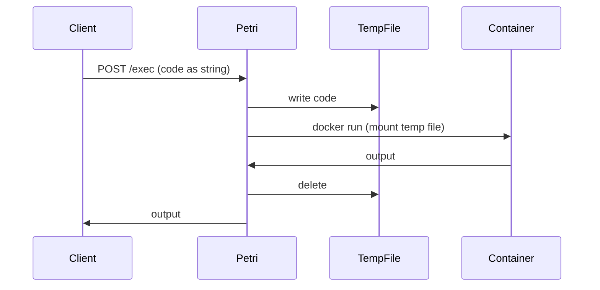
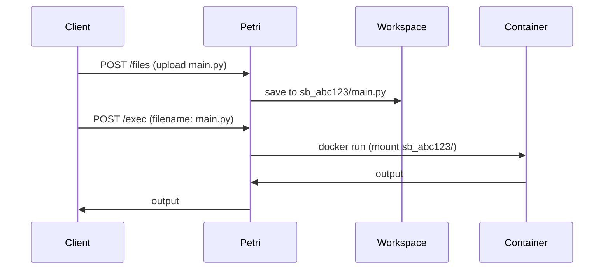

# ADR 005 - Persistent Workspace Model

## Status
Accepted

## Context
In v0.1, code is sent as a raw string in the request body on every execution. This has three problems:

1. Single file only - no multi-file projects, no dependencies
2. Code resent on every exec - wasteful, adds latency
3. No delta sync - even one character change requires a full send

## Decision
Introduce a persistent workspace per sandbox - a dedicated folder on disk that survives between executions.

Users upload files once. Exec targets a named file inside the workspace. Only changed files need to be re-uploaded.

The sandbox container mounts the workspace folder at `/sandbox` on each run.

## Consequences
- Multi-file projects are now possible
- Exec requests no longer carry code - just filename
- Delta sync becomes possible - upload only what changed
- Workspace must be on a host-mounted volume when Petri runs in a container
- A new endpoint is needed: POST /v1/sandboxes/{id}/files

## Architecture

### v0.1 — Ephemeral execution

### v0.2 — Persistent workspace

